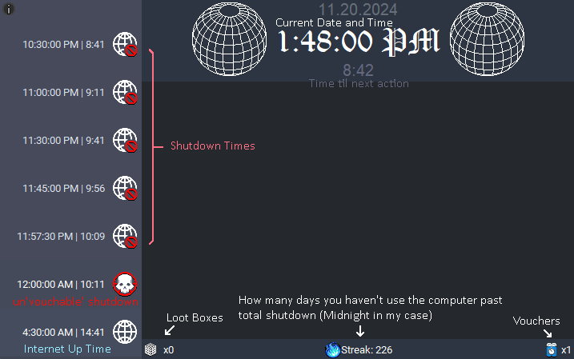

# Internet Manager

  

## What is it and why?
Basically I wanted an automated system that cut-off my internet reliably to enforce a strict bedtime, but also had the flexibility to delay that cut-off on occassion. So, I made this program that has a server and gui componenets. 
When the server is running all the functionality of internet manager is active, aka your internet connection will be cut at the configured times. The gui component allows the user to then visualize when the next cut off is as well as use the built in 'voucher' system to delay their impending cut-off.
Audio also can be configured to play to warn the user that a cut-off/shutdown is imminent. Regardless, the design is meant to be something that keeps the user informed, while allowing for a fairly strict, but slightly lenient internet shutdown experience.

> [!NOTE]
> This is a ***WINDOWS EXCLUSIVE* Local Internet Manager**, it only works on the machine its been downloaded onto, this is not like router parental controls

### How to set up with Installer Executable
1. Download the server/internet_manager installer from [the most recent release](https://github.com/HahnJustin/Internet-Manager/releases)
2. Run the installer
   
### How to set up with the Github Repository
1. Download the repository
2. Download python if you don't have python installed
3. Run the build batch script
4. Either
  - Install and run [Inno Setup](https://jrsoftware.org/isinfo.php) to create an installer in the Output folder then run that and you are done
  - Move the .exe files from the dist folder to your desired end point
5. Running the server/internet_manager will create their respective config files (The server will only create the config then close)
6. Modify the configs to what you wish (follow instructions below to modify config.yaml)
7. Then run create_tasks.exe to make sure the internet_manager runs every time the computer is booted up

> [!CAUTION]
> You must configure specifically the networks you want to shutdown with the manager, you can find the names of these using "view internet connections"
> This also for now means you must list Wi-Fi networks as well under the ethernet section

### How to configure the Internet Manager
1. Run the kill_server.exe and close the Internet Manager GUI if it is open
2. Open the config.yaml file in some text editor, Notepad++ is recommended
3. Change the config file as desired, namely add all Wi-Fi and Ethernet connections you want to shutdown under the ethernet section
4. Close config.yaml
5. Launch the internet_server again then the internet_manager
6. Check to see that the config changes are relfected in the GUI

### Explaining the UI
Here's a picture of the Internet Manager GUI with some text to explain what everything means.

  

### Future Changes
1. Add more instructions to the info menu
2. Add a live configuration menu, so that it doesn't need to be configured via manual editting of config.yaml
3. Automatically detect networks to diasable, add them to the config.yaml

Hope you enjoy it and let me know if you want any new features or have any issues
